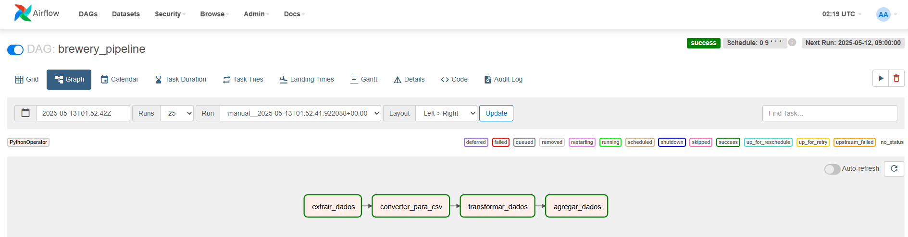
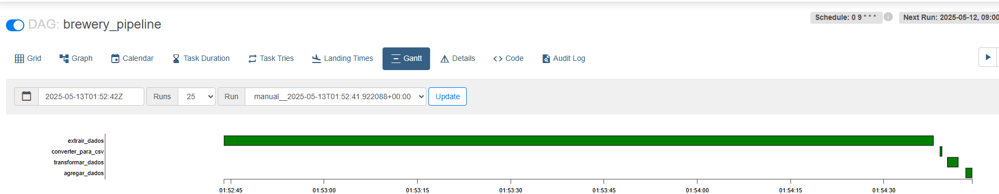
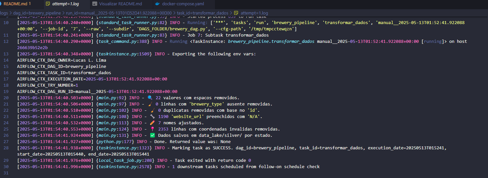

# 🎯 Objetivo

Consumir dados de uma API, transformos dados e utilizando o data lake com a [arquitetura medallion](https://learn.microsoft.com/pt-br/azure/databricks/lakehouse/medallion).

---

## 📋 Instruções do Desafio

- **API:** Use a Open Brewery DB API para buscar os dados de cervejarias.  
  👉 [https://www.openbrewerydb.org/](https://www.openbrewerydb.org/)

- **Orquestração:** Utilize uma ferramenta de orquestração de sua preferência (Airflow, Luigi, Mage etc.) para construir o pipeline de dados, incluindo agendamento, tentativas e tratamento de erros.

- **Linguagem:** Use a linguagem de sua escolha para consumir e transformar os dados. Inclua testes no seu código.  
  *Python e PySpark são preferidas.*

- **Containerização:** O uso de Docker ou Kubernetes conta pontos extras.

- **Arquitetura do Data Lake (Medallion):**
  - **Camada Bronze:** Armazene os dados brutos da API no formato nativo (JSON, CSV, etc.)
  - **Camada Prata:** Transforme os dados para um formato colunar (parquet ou delta) e particione por localização da cervejaria.
  - **Camada Ouro:** Crie uma visão agregada com a quantidade de cervejarias por tipo e localização.

- **Monitoramento e Alertas:** Descreva como você implementaria o monitoramento e alertas (falhas no pipeline, problemas de qualidade de dados etc.)

- **Repositório:** Crie um repositório público no GitHub com sua solução, explicando decisões de projeto e instruções para execução.

- **Serviços de Nuvem:** Caso utilize serviços em nuvem, forneça instruções de configuração separadamente (não poste no repositório público).

---

## 📊 Tabela Explicativa por Tópico

| Tópico                    | Descrição                                                                 |
|--------------------------|--------------------------------------------------------------------------|
| **API**                  | Open Brewery DB - fornece informações sobre cervejarias nos EUA.         |
| **Orquestração**         | Airflow, Luigi, Mage, etc. (mostrar agendamento, tentativas e erros)     |
| **Linguagem**            | Qualquer linguagem (preferência: Python + PySpark) com testes incluídos  |
| **Containerização**      | Uso de Docker ou Kubernetes é opcional, mas agrega pontos                |
| **Bronze Layer**         | Dados crus da API, sem transformação (JSON, CSV, etc.)                   |
| **Silver Layer**         | Dados transformados em parquet/delta, particionados por localização      |
| **Gold Layer**           | Dados agregados: número de cervejarias por tipo e localização            |
| **Monitoramento/Alertas**| Estratégia para capturar falhas e problemas de qualidade no pipeline     |
| **Repositório GitHub**   | Código + documentação clara e instruções para executar                   |
| **Serviços em Nuvem**    | Instruções de configuração separadas (caso usados)                       |

---

## Como executar a aplicação

### Software necessários

Para executar a aplição você irá precisar do [Docker Desktop](https://www.docker.com/), caso não tenha, favor instalar (Versão utilizada: 4.41.2).

Também é necessário uma IDE, no caso, sugiro o [VS Code](https://code.visualstudio.com/), que foi testado nesse desenvolvimento, mas as demais IDEs também devem funcionar, caso não tenha, favor instalar.

### Baixar repositório Git

Para baixar também é necessário ter o [Git](https://git-scm.com/downloads) instalado para conseguir baixar diretamente.

1. Abra o terminal CMD/Git
    - Também é possivel baixar diretamente no diretório, clique no botão "<> Code", depois Download ZIP. Extraia o arquivo para a pasta desejada e depois continue a partir do tópico 5.
  
2. Selecione o repositorio desejado.

    ```bash
    cd ~/Documentos
    ```

3. Clone o repositórioo com o comando:

    ```bash
    git clone https://github.com/lucasllimati/Projeto-AB-InBev.git
    ```

4. Entre na pasta

    ```bash
    cd Projeto-AB-InBev
    ```

5. Abra o VS Code como comando. Ou mesmo, abra o VS Code manualmente, vá em arquivo, abrir pasta e selecione a pasta onde baixou o arquivo.

    ```bash
      code .
    ```

6. Abra o terminal e execute o código (criação do container)

    ```bash
      docker-compose up -d
    ```

7. Quando terminar de instalar, abra o navegado e acesse o link [http://localhost:8080/](http://localhost:8080/)
    User: airflow
    Password: airflow

8. Quando abrir o Airflow, procure a DAG *brewery_pipeline* e do lado esquerdo, abaixo de actions clique em play.

9. Para acompanhar a execução, clice na *brewery_pipeline* edepois em Graph.

10. Quando todas as caixinhas ficarem verde escuro o processo foi executado com sucesso.

11. Para verificar os arquivos, abra a pasta data_lake e lá estará os arquivos atualizados do processo de extração da Open Brewery DB API.

12. Para finalizar, para a execução do container com o código abaixo

    ```bash
      docker-compose down
    ```

## Lógica do desenvolvimento

Abaixo esta mais detalhes de como foi desenvolvido esse processo.

### Main.py

Extração: Realiza a extração dos dados da API Open Brewery DB, coletando a lista completa de cervejarias de forma paginada. Os dados são armazenados em formato JSON na camada bronze. Também há uma etapa adicional que converte esse JSON para CSV, facilitando a visualização e exploração.

Transformação (Limpeza): Remove espaços em branco das colunas, elimina registros inválidos (como linhas sem brewery_type e IDs duplicados), preenche valores nulos na coluna website_url com "N/A", normaliza os textos (sem acentos, tudo em minúsculas e sem espaços extras) e valida as coordenadas geográficas (removendo valores fora dos limites esperados). Após os tratamentos, os dados são particionados por estado e salvos em formato .parquet na camada silver.

Agregação: Consolida os dados transformados, agrupando por tipo de cervejaria e estado, e salva o resultado final na camada gold, também em formato .parquet.

Obs: A etapa de testes foi desenvolvida de forma simples, utilizando o Try Catch para exibir os erros e jogando no log.

Resumo:
O pipeline segue estas etapas:
Extração: Coleta todos os dados da API paginadamente.
Conversão: Transforma JSON → CSV.
Transformação: Aplica tratamentos robustos (limpeza, padronização, filtro e particionamento).
Agregação: Agrupa dados por tipo de cervejaria e estado.

### Brewery_dag.py

Faz as configurações com as informações básicas, execução as funções e também o agendamento recorrente para a aplicação executar.

### docker-compose.yaml

Foi utilizado como refencia o modelo que esta no próprio site do airflow [link](www.teste.com).

Esse arquivo é um docker-compose.yaml que configura um ambiente de Apache Airflow, com todas as configurações necessárias da aplicação que esta no docker para a integração com o orquestrador Apache Web.

### Dockerfile

Esse Dockerfile é uma configuração de um contêiner para rodar um projeto baseado em Apache Airflow com Python, onde as dependências e arquivos necessários são instalados e copiados para dentro do contêiner, junto com as bibliotecas e dependências.

### Airflow

Interface gráfica para executar, monitor os processos (DAGs) que estão sendo executadas. Durante a execução ele vai criando logs extras de toda a execução, melhorando a visibilidade e entendimento em caso de problemas.



#### Logs

O processo gera logs do próprio fluxo do Airflow e também de etapas que foram criadas durante o desenvolvimento do main.py.


## ✅ Checklist do Projeto

- Simplificar a configuração do docker-compose.yaml e Dockerfil. Esta com a imagem um pouco pesada e como é um processo simples, porém como tive vários problemas de compatibilidade, acabei deixndo dessa forma.
- Melhoria dos Logs (Foram desenvolvidos no Main.py), porém quando passei para o Airflow ele acaba ficando um pouco fora do padrão e seria interessante simplificar e padronizar os logs.
- Envio de e-mail em caso de sucesso ou falha.
- Criação de cenários de testes.
- Após as melhorias publicar em Nuvem, facilitando a manutenção e não dependendo de uma máquina especifica para executar o processo.

Checklist de acompanhamento:

### 🔄 API

- [x] Conectar à API Open Brewery DB  
- [x] Coletar e armazenar os dados brutos

### ⚙️ Orquestração

- [x] Escolher ferramenta (Airflow, Luigi, Mage, etc.)  
- [x] Implementar agendamento  
- [x] Implementar tentativas e tratamento de erros

### 🐍 Linguagem

- [x] Escolher linguagem (preferência: Python/PySpark)  
- [ ] Criar testes para o código

### 🐳 Containerização (opcional, mas recomendada)

- [x] Criar Dockerfile  
- [x] Executar aplicação em container

### 🏗️ Arquitetura Medallion

- [x] Bronze Layer: salvar dados brutos da API  
- [x] Silver Layer: transformar para parquet/delta  
- [x] Silver Layer: particionar por localização  
- [x] Gold Layer: criar agregação por tipo e localização

### 📡 Monitoramento e Alertas

- [x] Definir abordagem para monitoramento de falhas e qualidade de dados

### 📁 Repositório GitHub

- [x] Subir projeto para repositório público  
- [x] Documentar decisões técnicas  
- [x] Incluir instruções de execução (README)

### ☁️ Serviços em Nuvem (se aplicável)

- [ ] Incluir instruções de configuração fora do repositório

### ⏱️ Prazos

- [x] Entregar em até 1 semana  
- [x] Compartilhar link do repositório GitHub com o time BEES
